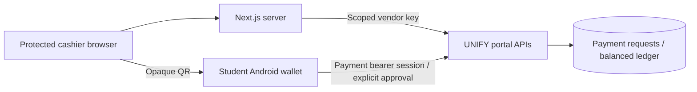

# UNIFY POS simulator

A small prepared-sale terminal that integrates with the **real UNIFY payment APIs**. It creates a fixed ZAR checkout, displays its QR, polls its result and prints the authoritative payment receipt. The student approves the debit in the native UNIFY wallet.

This is a **test-money demonstration**, not a catalogue, stock system, tax engine or production payments product. There is no simulator sales database, fake payment-success switch or direct access to the financial ledger.

## Architecture



The browser stores sale drafts and optional item snapshots. UNIFY stores request terms, state and completed financial movements. Item details are display-only: UNIFY supplies the authoritative amount and receipt. Recent sales are recovered from UNIFY, including after changing browsers.

## Setup

Use Node 24 and `npm ci`. Copy `.env.example` to `.env.local` and configure:

- `UNIFY_API_BASE_URL`: fixed HTTPS origin of the portal, without a path.
- `UNIFY_VENDOR_API_KEY`: server-only key with `payments:create`, `payments:read`, `payments:cancel`; restrict it to the configured test branch.
- `UNIFY_BRANCH_ID`: an approved payment-enabled branch of the dedicated test vendor.
- `POS_ORIGIN`: exact public HTTPS origin, used for same-origin mutation checks.
- `POS_OPERATOR_PASSWORD`: random password of at least 16 characters.
- `POS_SESSION_SECRET`: independent random secret of at least 32 characters.

For Vercel, configure an active distributed firewall rule matching `POST /api/operator`: **5 requests per IP per 900 seconds, deny excess requests**. Publish the rule, then set `POS_LOGIN_FIREWALL_ENABLED=true`. Do not set that flag without the active rule. Alternatively provide Upstash REST URL/token for counters; no sales or financial data goes to Redis. Login fails closed on Vercel if neither protection is configured. The application also has a per-instance counter as a secondary limit.

The deployment created for this project uses Vercel's firewall, so Redis is not required. Password/secret rotation invalidates existing sessions. Cookie lifetime is eight hours, with Secure, HttpOnly and SameSite=Strict in production. Every sales route checks the session; mutations check the configured origin.

## Integration contract

```http
POST /api/vendor/v1/payment-requests
Authorization: Bearer <server-side-vendor-key>
Content-Type: application/json

{"branchId":"approved-branch","orderReference":"POS-unique-sale","amountMinor":3500,"currency":"ZAR","idempotencyKey":"stable-sale-key"}
```

Read `GET /api/vendor/v1/payment-requests/{id}`, list `GET /api/vendor/v1/payment-requests?limit=20`, or cancel with `POST /api/vendor/v1/payment-requests/{id}/cancel`. The response contains an opaque `unifywallet://pay-request/{id}` QR and server expiry. An order reference and creation key identify one immutable sale; retries must retain both and its total.

States are `PENDING`, `PAID`, `CANCELLED`, `EXPIRED`. Requests expire after ten minutes. Only `PAID` permits printing a receipt. A browser countdown never asserts an outcome. Network failures retain the sale and back off polling to 30 seconds; reconnect checks that same reference. Cancel and pay races are decided in UNIFY's database.

## Demo acceptance

1. Use an approved **test** vendor/branch and a student with an activated, funded payment wallet. Install the coordinated Android wallet release supporting payment-request QR codes.
2. Sign in at `/terminal`, select an example sale and edit quantities/prices.
3. Create checkout, expand the customer display, scan with the wallet, unlock, review the fixed amount and explicitly approve.
4. Confirm the POS changes to **Payment confirmed** and the portal shows the same order reference, transaction and total. Print the receipt.
5. Create and cancel an unpaid sale; verify the wallet cannot pay it.
6. Let a request expire; verify neither a stale QR nor a delayed approval can debit it.
7. Interrupt connectivity after create/pay submission; recover the original reference and verify only one request/spend exists. Refresh the browser and recover recent sales.

API callbacks, refund execution, FIFO refund obligations and payout changes are separate increments. The API supports refund scopes for future use; this terminal has no refund control.

## Checks and deployment

`npm run typecheck`, `npm run lint`, `npm test`, `npm run build`. For this implementation, run checks on the team's EC2 validation workspace or CI; use Vercel CLI for deployment and deployed checks. Keep secrets out of public source and browser bundles.

Deploy the portal migration/APIs first, then the wallet and simulator. Configure a dedicated test key, deploy with `vercel --prod`, and check login, protected sales routes and checkout recovery at the public HTTPS URL. API examples require the new portal version; an older portal returns 404.
